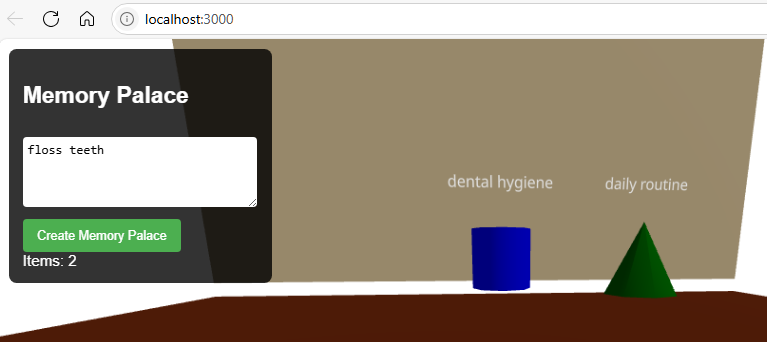

# Memory Palace 🧠✨

An AI-powered application that transforms any text content into immersive 3D memory palaces for enhanced learning and retention.

## 🌟 Overview

Memory Palace leverages the ancient memory technique of "loci" combined with modern AI and 3D visualization to help users memorize information more effectively. Input any content, and the AI analyzes it to create a personalized virtual environment where key concepts are represented as interactive 3D objects placed strategically throughout a room.

### Key Features

- **AI Content Analysis**: Uses Claude API to intelligently break down text into memorable concepts
- **3D Visualization**: Interactive memory palaces built with Three.js and React Three Fiber
- **Varied Object Types**: Concepts represented as cubes, spheres, cylinders, and cones for visual distinction  
- **Intuitive Navigation**: Click and drag controls for exploring your memory palace
- **Real-time Generation**: Create new memory palaces instantly from any text input

## 🚀 Demo



*Enter text content and watch as AI transforms it into a navigable 3D memory palace*

## 🛠️ Tech Stack

**Frontend:**
- React 18
- Three.js with React Three Fiber
- React Three Drei for enhanced 3D components
- Axios for API communication

**Backend:**
- Node.js with Express
- Anthropic Claude API for content analysis
- CORS middleware for cross-origin requests

**Development:**
- VS Code with recommended extensions
- Hot reload development environment
- Git version control

## 📋 Prerequisites

- Node.js (v18 or later)
- npm or yarn
- Anthropic API key (requires paid credits)
- Modern web browser with WebGL support

## 🔧 Installation

### 1. Clone the Repository
```bash
git clone https://github.com/yourusername/memory-palace.git
cd memory-palace
```

### 2. Backend Setup
```bash
cd backend
npm install
```

Create a `.env` file in the backend directory:
```env
ANTHROPIC_API_KEY=your-anthropic-api-key-here
PORT=3001
```

### 3. Frontend Setup
```bash
cd frontend/memory-palace-app
npm install
```

## 🚀 Running the Application

### Start the Backend Server
```bash
cd backend
npm run dev
```
The backend will start on `http://localhost:3001`

### Start the Frontend Development Server
```bash
cd frontend/memory-palace-app
npm start
```
The frontend will start on `http://localhost:3000`

## 🎯 Usage

1. **Enter Content**: Type or paste any text content you want to memorize in the text area
2. **Generate Palace**: Click "Create Memory Palace" to send content to AI for analysis
3. **Explore**: Use mouse controls to navigate the 3D environment:
   - **Click and drag** to look around
   - **Scroll** to zoom in/out
4. **Interact**: Click on any 3D object to see its associated concept and description
5. **Learn**: Walk through your memory palace to reinforce memorization

## 🏗️ Architecture

```
memory-palace/
├── backend/                 # Express.js API server
│   ├── services/
│   │   └── aiService.js    # Claude API integration
│   ├── server.js           # Main server file
│   ├── package.json
│   └── .env               # Environment variables
├── frontend/
│   └── memory-palace-app/  # React application
│       ├── src/
│       │   ├── App.js     # Main React component
│       │   └── App.css    # Styling
│       └── package.json
└── README.md
```

## 🔑 API Endpoints

### `GET /api/health`
Health check endpoint
- **Response**: `{ "status": "Server is running!" }`

### `POST /api/analyze-content`
Analyzes text content and returns memory palace data
- **Request Body**: `{ "content": "your text here" }`
- **Response**: 
```json
{
  "concepts": ["concept1", "concept2"],
  "memoryObjects": [
    {
      "concept": "concept1",
      "object": "cube",
      "color": "red",
      "position": [0, 1, -3],
      "description": "Description of the concept"
    }
  ]
}
```

## 🎨 3D Objects & Colors

**Object Types:**
- `cube` - Cubic geometry for structured concepts
- `sphere` - Spherical geometry for abstract ideas  
- `cylinder` - Cylindrical geometry for processes
- `cone` - Conical geometry for hierarchical concepts

**Available Colors:**
- red, blue, green, yellow, purple, orange, pink, cyan

## 🧪 Development

### VS Code Extensions (Recommended)
- ES7+ React/Redux/React-Native snippets
- Thunder Client (API testing)
- Live Server
- Prettier - Code formatter
- ESLint
- GitLens

### Testing the API
Use Thunder Client or any REST client:
```http
POST http://localhost:3001/api/analyze-content
Content-Type: application/json

{
  "content": "The solar system consists of the Sun and eight planets. Mercury is closest to the Sun."
}
```

### Debugging
- Backend logs appear in the terminal running `npm run dev`
- Frontend errors show in browser console
- Use VS Code debugger for breakpoint debugging

## 💡 Customization

### Adding New Object Types
1. Update the AI prompt in `backend/services/aiService.js` to include new object types
2. Add geometry cases in the `MemoryItem` component in `frontend/src/App.js`

### Modifying the Room Environment
Edit the `Room` component in `App.js` to change:
- Room dimensions
- Wall colors and textures
- Lighting setup
- Floor materials

### Enhancing AI Analysis
Modify the system prompt in `aiService.js` to:
- Extract different types of concepts
- Use alternative object placement strategies
- Add personality or themed environments

## 🚢 Deployment

### Backend (AWS Lambda + API Gateway)
```bash
# Package for serverless deployment
npm install -g serverless
serverless deploy
```

### Frontend (AWS S3 + CloudFront)
```bash
npm run build
# Upload build/ directory to S3 bucket
# Configure CloudFront distribution
```

## 📊 Cost Considerations

**Anthropic API Pricing (Claude 3.5 Haiku):**
- Input: $0.80 per million tokens
- Output: $4 per million tokens
- Typical cost per analysis: ~$0.01-0.02
- $5 provides approximately 250-500 analyses

## 🤝 Contributing

1. Fork the repository
2. Create a feature branch (`git checkout -b feature/amazing-feature`)
3. Commit your changes (`git commit -m 'Add amazing feature'`)
4. Push to the branch (`git push origin feature/amazing-feature`)
5. Open a Pull Request

### Development Guidelines
- Follow existing code style and patterns
- Add error handling for new features
- Test both frontend and backend changes
- Update documentation for new functionality

## 📝 License

This project is licensed under the MIT License - see the [LICENSE](LICENSE) file for details.

## 🙏 Acknowledgments

- **Memory Palace Technique**: Based on the ancient Greek and Roman "method of loci"
- **AI Integration**: Powered by Anthropic's Claude for intelligent content analysis
- **3D Visualization**: Built with the excellent Three.js and React Three Fiber libraries
- **Development Process**: Created through AI-assisted development with Claude Sonnet 4

## 🐛 Troubleshooting

### Common Issues

**"Module not found" errors:**
```bash
# Reinstall dependencies
cd frontend/memory-palace-app && npm install
cd backend && npm install
```

**API Authentication errors:**
- Verify your Anthropic API key in `.env`
- Ensure you have sufficient credits in your Anthropic account
- Check that `require('dotenv').config()` is the first line in `server.js`

**3D rendering issues:**
- Ensure your browser supports WebGL
- Try refreshing the page if objects don't appear
- Check browser console for Three.js errors

**Port conflicts:**
```bash
# Kill processes on ports 3000/3001
npx kill-port 3000
npx kill-port 3001
```

## 📧 Support

For questions, bug reports, or feature requests, please [open an issue](https://github.com/yourusername/memory-palace/issues) on GitHub.

---

**Built with ❤️ and AI assistance | Transforming learning through immersive technology**
